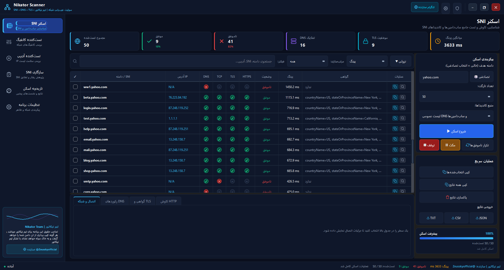
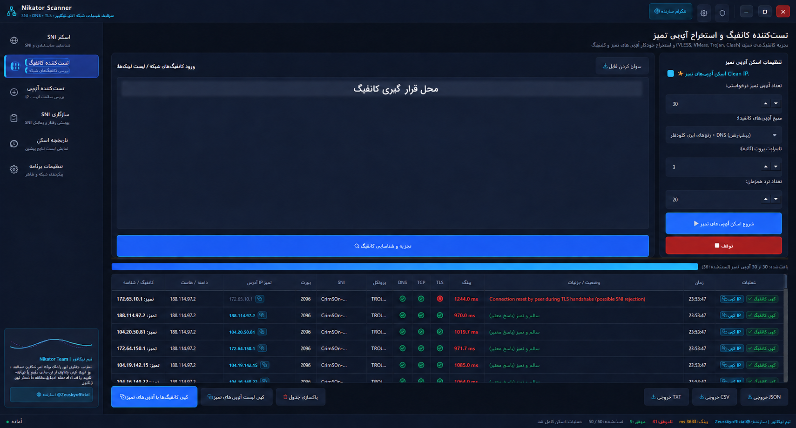
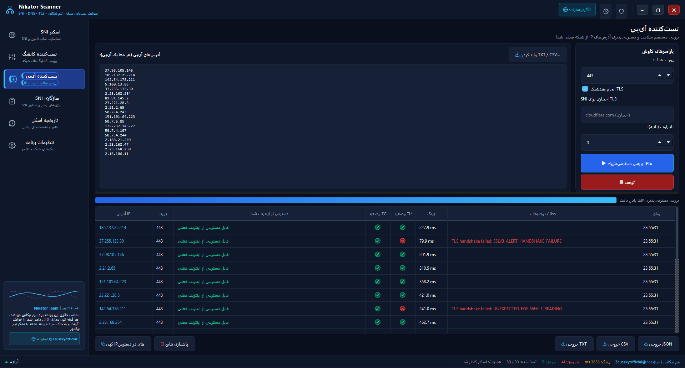

# Nikator Scanner

**فارسی** | [English](README.md)

**SNI Finder • IP Finder • IP Scanner • IP Config**

مجموعه‌ی دسکتاپ برای بررسی SNI، DNS، TCP، TLS، HTTP، دسترسی‌پذیری IP و سازگاری کانفیگ‌های شبکه

توسعه‌یافته توسط **تیم نیکاتور (Nikator Team)**  
سازنده و پشتیبانی: [@Zeusskyofficial](https://t.me/Zeusskyofficial)

---

## فهرست مطالب

- [معرفی برنامه](#معرفی-برنامه)
- [نمونه عملکرد برنامه](#نمونه-عملکرد-برنامه)
- [قابلیت‌ها](#قابلیت‌ها)
- [مفاهیم پایه](#مفاهیم-پایه)
- [اجرای برنامه](#اجرای-برنامه)
- [آموزش استفاده](#آموزش-استفاده)
- [تفسیر نتایج](#تفسیر-نتایج)
- [تنظیمات و محل ذخیره‌سازی](#تنظیمات-و-محل-ذخیرهسازی)
- [خروجی گرفتن](#خروجی-گرفتن)
- [کلیدهای میانبر](#کلیدهای-میانبر)
- [ساخت فایل اجرایی ویندوز](#ساخت-فایل-اجرایی-ویندوز)
- [رفع خطاهای رایج](#رفع-خطاهای-رایج)
- [حریم خصوصی و استفاده‌ی مسئولانه](#حریم-خصوصی-و-استفادهی-مسئولانه)

---

## معرفی برنامه

**Nikator Scanner** یک ابزار گرافیکی برای عیب‌یابی مرحله‌به‌مرحله‌ی ارتباطات شبکه است. این برنامه کمک می‌کند مشخص شود مشکل اتصال دقیقاً در کدام مرحله رخ می‌دهد:

1. تبدیل دامنه به IP در مرحله‌ی DNS
2. برقراری اتصال TCP با پورت مقصد
3. انجام TLS Handshake و بررسی گواهی امنیتی
4. دریافت پاسخ HTTP یا HTTPS

برنامه برای مدیران شبکه، توسعه‌دهندگان، پژوهشگران امنیت و کاربرانی طراحی شده است که می‌خواهند وضعیت دامنه، SNI، IP یا سرویس خود را با جزئیات بیشتری بررسی کنند.

رابط برنامه با **PySide6** ساخته شده و عملیات اسکن در پردازش‌های پس‌زمینه انجام می‌شود تا رابط کاربری هنگام بررسی چند هدف پاسخ‌گو باقی بماند.

---

## نمونه عملکرد برنامه

### نتایج اسکن SNI



نمونه‌ی شناسایی و بررسی SNI شامل وضعیت DNS، TCP، TLS، HTTPS، گواهی، نتیجه و میزان تأخیر.

### تست کانفیگ و استخراج IP تمیز



نمونه‌ی تجزیه‌ی کانفیگ و استخراج IPهای تمیز. کانفیگ واقعی برای حفاظت از اطلاعات دسترسی عمداً محو شده است.

### نتایج اسکن IP



نمونه‌ی بررسی دسترسی‌پذیری IP، اتصال TCP، وضعیت TLS، میزان تأخیر و نتیجه‌ی اتصال.

---

## قابلیت‌ها

### اسکن SNI و کشف زیردامنه

- دریافت دامنه‌ی اصلی و ساخت فهرست نامزدهای SNI
- استفاده از فهرست داخلی زیردامنه‌ها
- پشتیبانی از Wordlist دلخواه کاربر
- دریافت نام‌های عمومی از Certificate Transparency در `crt.sh`
- بررسی جداگانه‌ی DNS، TCP، TLS و HTTP
- نمایش آمار زنده، درصد موفقیت و میانگین تأخیر
- مشاهده‌ی جزئیات گواهی X.509، صادرکننده، SAN، تاریخ اعتبار و Cipher

### تست کانفیگ شبکه

- شناسایی امن مقصدها از قالب‌هایی مانند `vless://`، `vmess://`، `trojan://`، `ss://` و `https://`
- پشتیبانی از ورودی متنی و ساختارهای رایج JSON یا YAML
- استخراج Host، Port و SNI بدون اجرای محتوای کانفیگ
- بررسی DNS، TCP و TLS مقصدهای استخراج‌شده
- ساخت نسخه‌ی کانفیگ با IP سالم در موارد پشتیبانی‌شده

### تست دسترسی‌پذیری IP

- پذیرش IPv4 و IPv6
- ورود مستقیم چند IP یا خواندن از فایل TXT/CSV
- بررسی پورت، TLS و زمان پاسخ
- تفکیک خطای شبکه‌ی محلی از خطای سرویس مقصد

### بررسی سازگاری SNI

- آزمایش SNIهای مختلف روی IP یا Front موردنظر
- بررسی تطابق گواهی با نام SNI
- پشتیبانی از SAN و Wildcard Certificate
- مقایسه‌ی حالت‌های مختلف برای پژوهش سازگاری

### تاریخچه و گزارش‌ها

- ذخیره‌ی نشست‌های اسکن در SQLite
- جست‌وجو و مشاهده‌ی جزئیات نتایج قبلی
- حذف نشست‌های انتخاب‌شده یا پاک‌سازی تاریخچه
- خروجی در قالب‌های JSON، CSV و TXT

---

## مفاهیم پایه

| مرحله | چه چیزی بررسی می‌شود؟ | نمونه‌ی خطا |
|---|---|---|
| DNS | آیا دامنه به IP تبدیل می‌شود؟ | دامنه وجود ندارد یا Resolver پاسخ نمی‌دهد |
| TCP | آیا اتصال به IP و Port برقرار می‌شود؟ | پورت بسته، Timeout یا Firewall |
| TLS | آیا ارتباط رمزنگاری‌شده برقرار می‌شود؟ | SNI اشتباه، گواهی نامعتبر یا ناسازگاری نسخه‌ی TLS |
| HTTP | آیا سرویس وب پاسخ می‌دهد؟ | کد خطای 4xx/5xx، Redirect یا عدم پاسخ |

### SNI چیست؟

SNI یا **Server Name Indication** نام دامنه‌ای است که هنگام شروع TLS Handshake برای سرور ارسال می‌شود. وقتی چند دامنه از یک IP مشترک استفاده می‌کنند، سرور با کمک SNI گواهی و سرویس درست را انتخاب می‌کند.

### تفاوت «اتصال موفق» و «گواهی منطبق»

ممکن است TLS Handshake موفق باشد اما گواهی دریافت‌شده برای SNI موردنظر صادر نشده باشد. در این حالت ارتباط فنی برقرار شده است، ولی هویت دامنه تأیید نمی‌شود. برنامه این دو وضعیت را جداگانه نمایش می‌دهد.

---

## اجرای برنامه

**Nikator Scanner پرتابل است و نیازی به نصب ندارد.**

1. فایل برنامه را دریافت کنید.
2. اگر فایل داخل ZIP است، ابتدا آن را کامل Extract کنید.
3. روی `NikatorScanner.exe` دوبار کلیک کنید.
4. برنامه مستقیماً باز می‌شود و نیازی به Setup، نصب Python یا نصب کتابخانه‌ی جداگانه ندارد.

---

## آموزش استفاده

### ۱. اسکن دامنه و SNI

1. از منوی کناری وارد صفحه‌ی اسکن SNI شوید.
2. دامنه را بدون `https://` و بدون مسیر اضافی وارد کنید؛ برای مثال `example.com`.
3. منبع نامزدها را انتخاب کنید: فهرست داخلی، CT Logs یا Wordlist شخصی.
4. Timeout، تعداد تلاش مجدد و میزان هم‌زمانی را متناسب با کیفیت شبکه تنظیم کنید.
5. اسکن را شروع کنید و آمار زنده را دنبال کنید.
6. با انتخاب هر ردیف، جزئیات DNS، TCP، TLS، گواهی و HTTP را ببینید.

برای شروع، Concurrency متوسط انتخاب کنید. مقدار بسیار بالا ممکن است باعث Rate Limit، مصرف زیاد منابع یا نتایج ناپایدار شود.

### ۲. آزمایش کانفیگ

1. وارد صفحه‌ی «تست‌کننده کانفیگ» شوید.
2. کانفیگ‌ها را در کادر ورودی قرار دهید یا فایل را وارد کنید.
3. پس از Parse، مقصدهای استخراج‌شده را بررسی کنید.
4. تست را اجرا کنید تا وضعیت DNS، TCP و TLS هر مقصد مشخص شود.
5. در صورت پشتیبانی قالب، می‌توانید نسخه‌ی کانفیگ با IP انتخابی را کپی کنید.

> کانفیگ واقعی ممکن است حاوی UUID، رمز یا اطلاعات دسترسی باشد. آن را در Issue، Screenshot، فایل عمومی یا خروجی قابل‌اشتراک قرار ندهید.

### ۳. آزمایش IP

1. در صفحه‌ی IP Tester، هر IP را در یک خط وارد کنید.
2. پورت موردنظر را مشخص کنید؛ پورت پیش‌فرض سرویس‌های HTTPS معمولاً `443` است.
3. برای بررسی TLS می‌توانید SNI مناسب را نیز وارد کنید.
4. نتایج اتصال و Latency را مشاهده یا ذخیره کنید.

نمونه‌ی ورودی:

```text
1.1.1.1
8.8.8.8
```

### ۴. بررسی سازگاری SNI

1. IP یا Front هدف را وارد کنید.
2. فهرست SNIها را از ورودی کاربر یا Dataset عمومی انتخاب کنید.
3. اسکن را اجرا کنید.
4. ستون تطابق گواهی را بررسی کنید؛ Handshake موفق به‌تنهایی به معنی تطابق دامنه نیست.

### ۵. مشاهده‌ی تاریخچه

صفحه‌ی تاریخچه نشست‌های قبلی را نشان می‌دهد. از این قسمت می‌توانید:

- نتایج یک نشست را دوباره بررسی کنید.
- نشست‌ها را جست‌وجو یا حذف کنید.
- نتیجه‌ی انتخاب‌شده را به فایل تبدیل کنید.

---

## تفسیر نتایج

| وضعیت | معنی پیشنهادی |
|---|---|
| Success | مراحل لازم برای آن تست با موفقیت تکمیل شده‌اند |
| Failed | یک یا چند مرحله ناموفق بوده‌اند؛ جزئیات ردیف را باز کنید |
| Timeout | مقصد در زمان تعیین‌شده پاسخ نداده است |
| DNS Error | دامنه Resolve نشده یا Resolver در دسترس نیست |
| TCP Error | اتصال به IP و Port برقرار نشده است |
| TLS Error | TLS Handshake، گواهی یا SNI مشکل دارد |

نتیجه‌ی یک تست به شرایط همان لحظه‌ی شبکه وابسته است. برای نتیجه‌ی مطمئن‌تر، آزمایش را در چند زمان و در صورت نیاز با DNS متفاوت تکرار کنید.

---

## تنظیمات و محل ذخیره‌سازی

تنظیمات کاربر به‌صورت محلی ذخیره می‌شوند:

```text
~/.nikator_scanner/config.json
```

تاریخچه‌ی اسکن‌ها:

```text
~/.nikator_scanner/history.db
```

فایل‌های گزارش در صورت فعال بودن Logging:

```text
~/.nikator_scanner/logs/nikator_scanner.log
```

از صفحه‌ی تنظیمات می‌توان موارد زیر را تغییر داد:

- Timeout مربوط به DNS، TCP، TLS و HTTP
- DNS Resolverهای دلخواه
- تعداد Workerها و تلاش مجدد
- فاصله‌ی بین درخواست‌ها
- اندازه‌ی فونت و حالت فشرده‌ی جدول
- سطح Logging و مدت نگهداری تاریخچه
- پوشه‌ی پیش‌فرض خروجی

---

## خروجی گرفتن

### JSON

مناسب برای پردازش برنامه‌نویسی، آرشیو ساختاریافته یا انتقال به ابزارهای دیگر.

### CSV

مناسب برای Excel، Google Sheets و تحلیل جدولی.

### TXT

مناسب برای مطالعه‌ی مستقیم، گزارش ساده و بایگانی متنی.

پیش از اشتراک‌گذاری خروجی، Host، IP، SNI، گواهی و سایر اطلاعات زیرساختی را بازبینی کنید.

---

## کلیدهای میانبر

| میانبر | عملکرد |
|---|---|
| `Ctrl + C` | کپی ردیف‌های انتخاب‌شده |
| `Ctrl + A` | انتخاب تمام ردیف‌ها |
| `Ctrl + F` | رفتن به بخش جست‌وجو |
| `Ctrl + S` | خروجی سریع نتایج |
| `F5` | تلاش مجدد برای موارد ناموفق |
| `Escape` | بستن پنجره یا Dialog فعال |

---

## ساخت فایل اجرایی ویندوز

ابتدا PyInstaller را نصب کنید:

```bash
python -m pip install pyinstaller
```

سپس از فایل Spec موجود استفاده کنید:

```bash
pyinstaller pyinstaller.spec
```

خروجی در مسیر زیر ساخته می‌شود:

```text
dist/NikatorScanner.exe
```

---

## رفع خطاهای رایج

### برنامه باز نمی‌شود

- برنامه را مستقیماً از داخل فایل ZIP اجرا نکنید؛ ابتدا همه‌ی فایل‌ها را Extract کنید.
- بررسی کنید آنتی‌ویروس فایل را قرنطینه نکرده باشد.
- نسخه‌ی رسمی و جدید برنامه را دوباره دریافت کنید.
- یک‌بار برنامه را با گزینه‌ی **Run as administrator** اجرا کنید.

### نمایش هشدار Windows SmartScreen

اگر فایل را از صفحه‌ی رسمی پروژه دریافت کرده‌اید، روی **More info** و سپس **Run anyway** بزنید. فایل دریافت‌شده از منبع ناشناس را اجرا نکنید.

### Timeout زیاد یا نتیجه‌ی ناپایدار

- Concurrency را کاهش دهید.
- Timeout را کمی افزایش دهید.
- DNS Resolver دیگری انتخاب کنید.
- اتصال اینترنت و محدودیت Firewall را بررسی کنید.

### خطای TLS یا عدم تطابق گواهی

- SNI را بررسی کنید.
- ساعت و تاریخ سیستم را کنترل کنید.
- مطمئن شوید پورت مقصد واقعاً TLS ارائه می‌دهد.
- جزئیات Subject و SAN گواهی را مشاهده کنید.

---

## حریم خصوصی و استفاده‌ی مسئولانه

- برنامه برای عیب‌یابی شبکه، بررسی DNS و ارزیابی سازگاری TLS طراحی شده است.
- فقط سامانه‌هایی را آزمایش کنید که مالک آن هستید یا مجوز صریح بررسی آن‌ها را دارید.
- برنامه برای Exploit، نفوذ یا دور زدن مجوز دسترسی طراحی نشده است.
- کانفیگ‌ها، تاریخچه‌ها و خروجی‌ها ممکن است اطلاعات حساس زیرساخت را شامل شوند؛ قبل از اشتراک‌گذاری آن‌ها را بازبینی کنید.
- فایل‌های محلی مانند دیتابیس، لاگ، خروجی‌ها، محیط‌های مجازی و کلیدها توسط `.gitignore` از مخزن دور نگه داشته می‌شوند.
- یک محافظ محلی پیش از Commit نیز الگوهای رایج توکن و کلید را بررسی می‌کند.

---

## ساختار پروژه

```text
nikator-scanner/
├── data/          # Datasetهای عمومی
├── database/      # مدیریت تاریخچه SQLite
├── models/        # مدل‌های داده و نتیجه
├── network/       # DNS، TCP، TLS و HTTP
├── parsers/       # تجزیه‌ی امن کانفیگ‌ها
├── scanners/      # موتورهای اسکن
├── ui/            # رابط گرافیکی PySide6
├── utils/         # تنظیمات، خروجی و ابزارهای کمکی
├── main.py        # نقطه‌ی شروع برنامه
└── requirements.txt
```

---

## پشتیبانی

برای گزارش مشکل، ابتدا توضیح خطا، سیستم‌عامل، نسخه‌ی Python و مراحل بازتولید را آماده کنید. اطلاعات حساس، توکن یا کانفیگ واقعی را در گزارش عمومی قرار ندهید.

تلگرام سازنده و پشتیبانی: [@Zeusskyofficial](https://t.me/Zeusskyofficial)

---

## حقوق استفاده

تمامی حقوق این پروژه متعلق به **تیم نیکاتور** است. این مخزن در حال حاضر فایل مجوز مستقل ندارد؛ بنابراین استفاده، بازنشر یا ایجاد نسخه‌ی مشتق‌شده باید با اجازه‌ی صاحب پروژه انجام شود.
